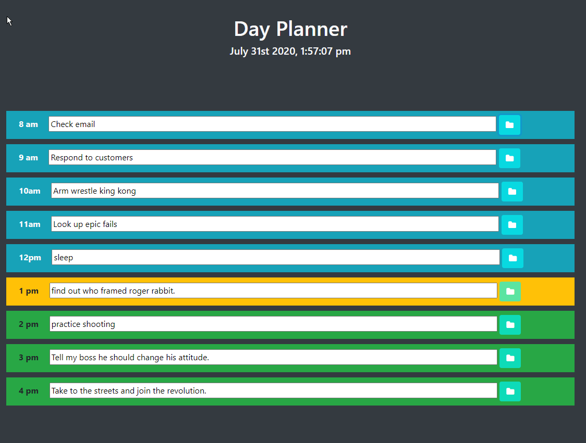

# daily-planner

I built a code daily planner because I thought it would be a fun and useful project.

## This project was incredibly challenging.  It tested my wits, and made me think outside the box.

### J query
	This project taught me how to use J Query to the best of my ability. I used everything that I learned in Javascript and spent hours looking up the J query syntax. This project taught me to think like a program.

https://greezon.github.io/daily-planner/

## Contributing
Pull requests are welcome. I will not be reviewing any changes from any unknown source.

## License
[MIT](https://choosealicense.com/licenses/mit/)
